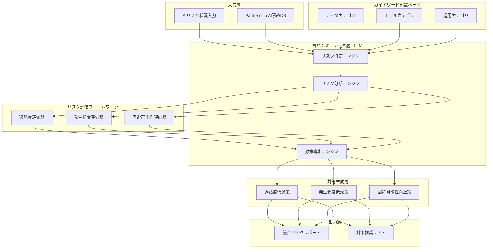
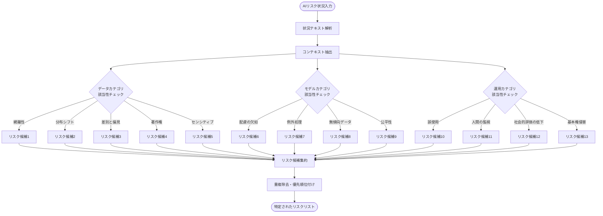
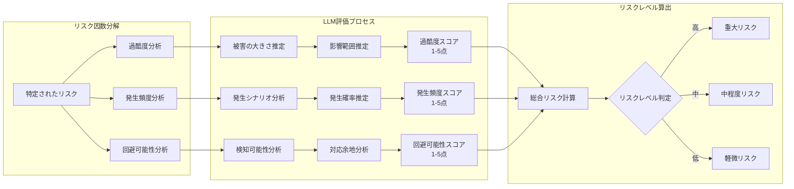
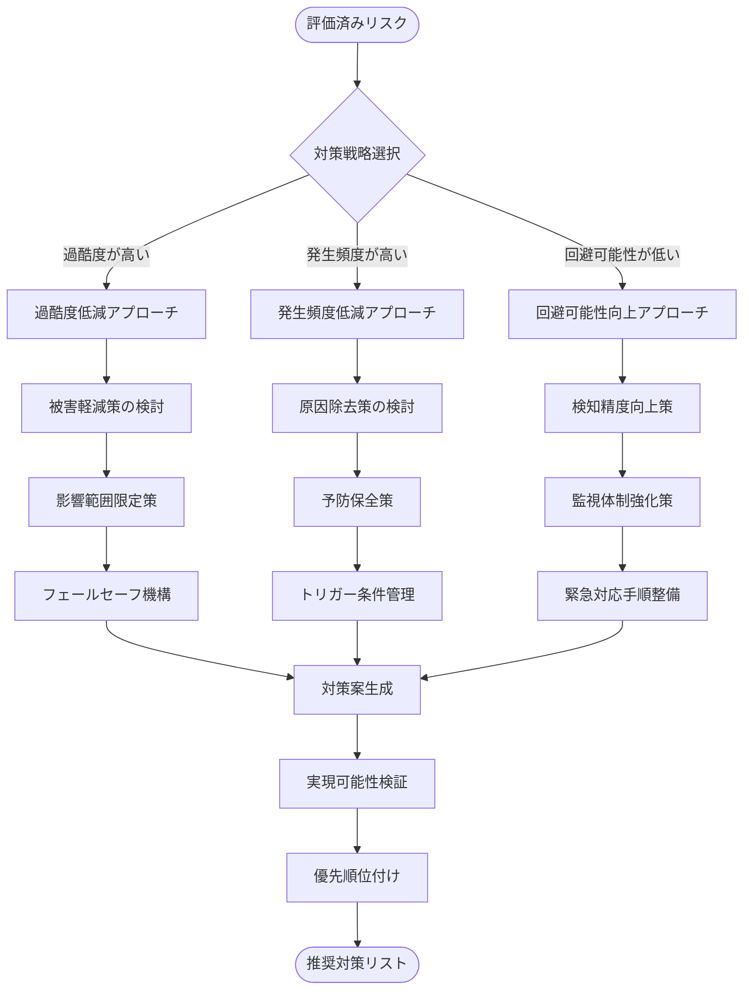
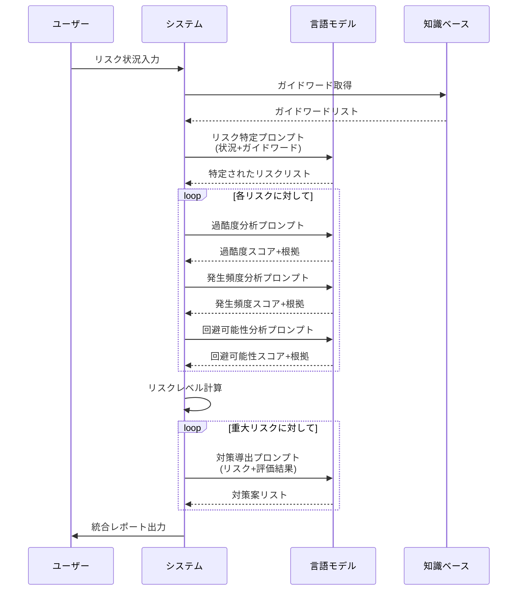
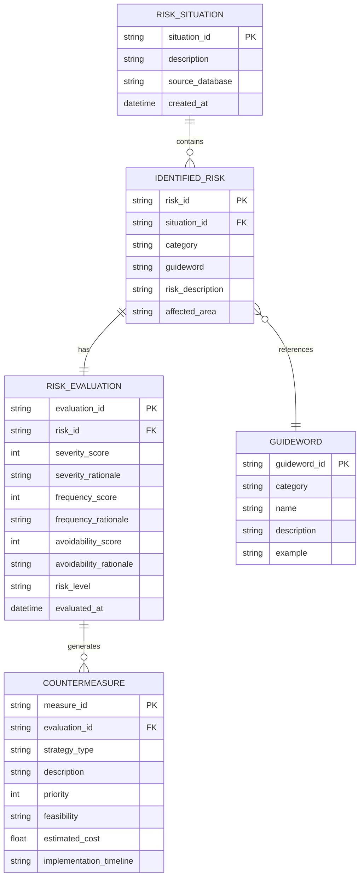

# AIリスクアセスメント言語システム アーキテクチャ図

## 1. システム全体図

```mermaid
graph TB
    subgraph "入力層"
        A[AIリスク状況入力]
        B[Partnership AI事故DB]
    end
    
    subgraph "言語シミュレータ層 - LLM"
        C[リスク特定エンジン]
        D[リスク分析エンジン]
        E[対策導出エンジン]
    end
    
    subgraph "ガイドワード知識ベース"
        F1[データカテゴリ]
        F2[モデルカテゴリ]
        F3[運用カテゴリ]
    end
    
    subgraph "リスク評価フレームワーク"
        G1[過酷度評価器]
        G2[発生頻度評価器]
        G3[回避可能性評価器]
    end
    
    subgraph "対策生成層"
        H1[過酷度低減策]
        H2[発生頻度低減策]
        H3[回避可能性向上策]
    end
    
    subgraph "出力層"
        I[統合リスクレポート]
        J[対策推奨リスト]
    end
    
    A --> C
    B --> C
    F1 --> C
    F2 --> C
    F3 --> C
    
    C --> D
    
    D --> G1
    D --> G2
    D --> G3
    
    G1 --> E
    G2 --> E
    G3 --> E
    
    E --> H1
    E --> H2
    E --> H3
    
    H1 --> I
    H2 --> I
    H3 --> I
    
    H1 --> J
    H2 --> J
    H3 --> J
```

## 2. リスク特定プロセスフロー

```mermaid
flowchart TD
    Start([AIリスク状況入力]) --> Parse[状況テキスト解析]
    Parse --> Context[コンテキスト抽出]
    
    Context --> DataCheck{データカテゴリ<br/>該当性チェック}
    Context --> ModelCheck{モデルカテゴリ<br/>該当性チェック}
    Context --> OperCheck{運用カテゴリ<br/>該当性チェック}
    
    DataCheck -->|網羅性| R1[リスク候補1]
    DataCheck -->|分布シフト| R2[リスク候補2]
    DataCheck -->|差別と偏見| R3[リスク候補3]
    DataCheck -->|著作権| R4[リスク候補4]
    DataCheck -->|センシティブ| R5[リスク候補5]
    
    ModelCheck -->|配慮の欠如| R6[リスク候補6]
    ModelCheck -->|例外処理| R7[リスク候補7]
    ModelCheck -->|無傾向データ| R8[リスク候補8]
    ModelCheck -->|公平性| R9[リスク候補9]
    
    OperCheck -->|誤使用| R10[リスク候補10]
    OperCheck -->|人間の監視| R11[リスク候補11]
    OperCheck -->|社会的評価の低下| R12[リスク候補12]
    OperCheck -->|基本権侵害| R13[リスク候補13]
    
    R1 --> Aggregate[リスク候補集約]
    R2 --> Aggregate
    R3 --> Aggregate
    R4 --> Aggregate
    R5 --> Aggregate
    R6 --> Aggregate
    R7 --> Aggregate
    R8 --> Aggregate
    R9 --> Aggregate
    R10 --> Aggregate
    R11 --> Aggregate
    R12 --> Aggregate
    R13 --> Aggregate
    
    Aggregate --> Filter[重複除去・優先順位付け]
    Filter --> Output([特定されたリスクリスト])
```

## 3. リスク分析・評価フロー

```mermaid
flowchart LR
    subgraph "リスク因数分解"
        A[特定されたリスク] --> B[過酷度分析]
        A --> C[発生頻度分析]
        A --> D[回避可能性分析]
    end
    
    subgraph "LLM評価プロセス"
        B --> B1[被害の大きさ推定]
        B1 --> B2[影響範囲推定]
        B2 --> B3[過酷度スコア<br/>1-5点]
        
        C --> C1[発生シナリオ分析]
        C1 --> C2[発生確率推定]
        C2 --> C3[発生頻度スコア<br/>1-5点]
        
        D --> D1[検知可能性分析]
        D1 --> D2[対応余地分析]
        D2 --> D3[回避可能性スコア<br/>1-5点]
    end
    
    subgraph "リスクレベル算出"
        B3 --> E[総合リスク計算]
        C3 --> E
        D3 --> E
        E --> F{リスクレベル判定}
        F -->|高| G1[重大リスク]
        F -->|中| G2[中程度リスク]
        F -->|低| G3[軽微リスク]
    end
```

## 4. 対策導出メカニズム

```mermaid
flowchart TD
    Start([評価済みリスク]) --> Strategy{対策戦略選択}
    
    Strategy -->|過酷度が高い| Severity[過酷度低減アプローチ]
    Strategy -->|発生頻度が高い| Frequency[発生頻度低減アプローチ]
    Strategy -->|回避可能性が低い| Avoidability[回避可能性向上アプローチ]
    
    Severity --> S1[被害軽減策の検討]
    S1 --> S2[影響範囲限定策]
    S2 --> S3[フェールセーフ機構]
    
    Frequency --> F1[原因除去策の検討]
    F1 --> F2[予防保全策]
    F2 --> F3[トリガー条件管理]
    
    Avoidability --> A1[検知精度向上策]
    A1 --> A2[監視体制強化策]
    A2 --> A3[緊急対応手順整備]
    
    S3 --> Generate[対策案生成]
    F3 --> Generate
    A3 --> Generate
    
    Generate --> Validate[実現可能性検証]
    Validate --> Prioritize[優先順位付け]
    Prioritize --> Output([推奨対策リスト])
```

## 5. LLMプロンプトフロー

```mermaid
sequenceDiagram
    participant User as ユーザー
    participant System as システム
    participant LLM as 言語モデル
    participant KB as 知識ベース
    
    User->>System: リスク状況入力
    System->>KB: ガイドワード取得
    KB-->>System: ガイドワードリスト
    
    System->>LLM: リスク特定プロンプト<br/>(状況+ガイドワード)
    LLM-->>System: 特定されたリスクリスト
    
    loop 各リスクに対して
        System->>LLM: 過酷度分析プロンプト
        LLM-->>System: 過酷度スコア+根拠
        
        System->>LLM: 発生頻度分析プロンプト
        LLM-->>System: 発生頻度スコア+根拠
        
        System->>LLM: 回避可能性分析プロンプト
        LLM-->>System: 回避可能性スコア+根拠
    end
    
    System->>System: リスクレベル計算
    
    loop 重大リスクに対して
        System->>LLM: 対策導出プロンプト<br/>(リスク+評価結果)
        LLM-->>System: 対策案リスト
    end
    
    System->>User: 統合レポート出力
```

## 6. データモデル

```mermaid
erDiagram
    RISK_SITUATION ||--o{ IDENTIFIED_RISK : contains
    IDENTIFIED_RISK ||--|| RISK_EVALUATION : has
    RISK_EVALUATION ||--o{ COUNTERMEASURE : generates
    
    RISK_SITUATION {
        string situation_id PK
        string description
        string source_database
        datetime created_at
    }
    
    IDENTIFIED_RISK {
        string risk_id PK
        string situation_id FK
        string category
        string guideword
        string risk_description
        string affected_area
    }
    
    RISK_EVALUATION {
        string evaluation_id PK
        string risk_id FK
        int severity_score
        string severity_rationale
        int frequency_score
        string frequency_rationale
        int avoidability_score
        string avoidability_rationale
        string risk_level
        datetime evaluated_at
    }
    
    COUNTERMEASURE {
        string measure_id PK
        string evaluation_id FK
        string strategy_type
        string description
        int priority
        string feasibility
        float estimated_cost
        string implementation_timeline
    }
    
    GUIDEWORD {
        string guideword_id PK
        string category
        string name
        string description
        string example
    }
    
    IDENTIFIED_RISK }o--|| GUIDEWORD : references
```
